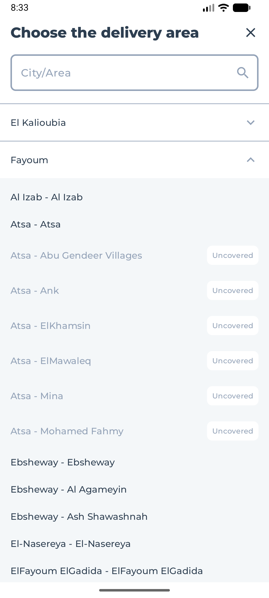
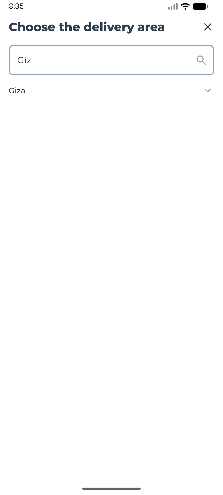
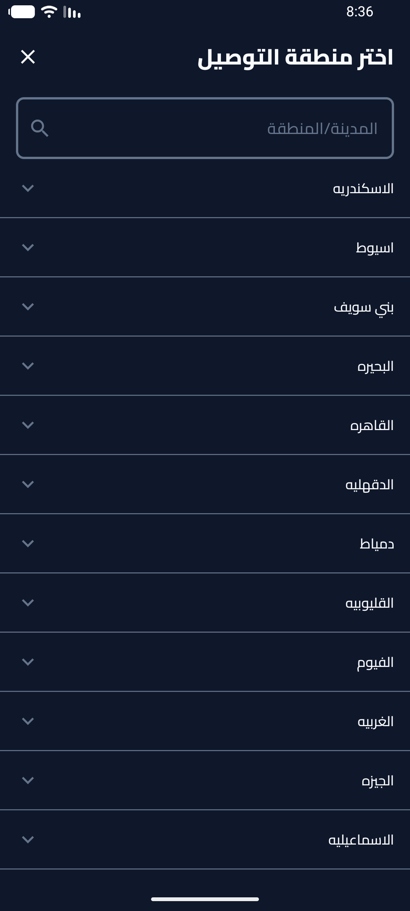
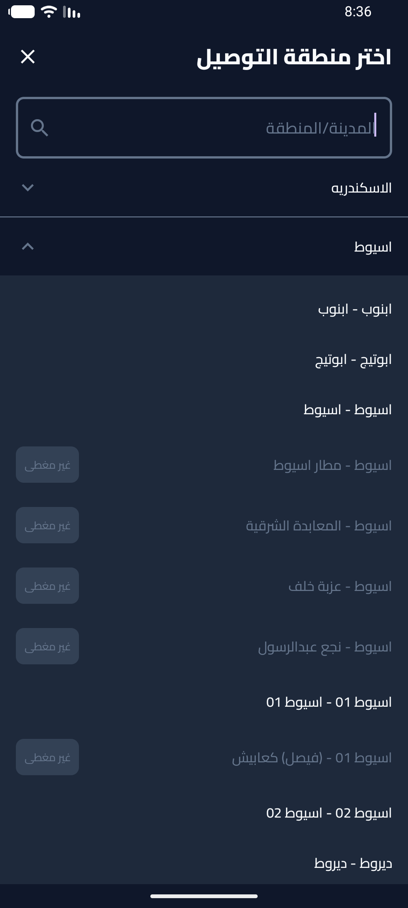

# Bosta Assessment - Delivery Area Search

An Android application that allows users to search and browse delivery areas (cities and districts). This project demonstrates modern Android development practices using Jetpack Compose, Clean Architecture, and Dependency Injection with Hilt.

## Features

- **Search Delivery Areas**: Browse a comprehensive list of cities and districts.
- **Bi-lingual Support**: Full support for English and Arabic languages, including RTL layout.
- **Clean Architecture**: Separation of concerns into Data, Domain, and Presentation layers.
- **Modern UI**: Built entirely with Jetpack Compose for a reactive and declarative UI.

## Screenshots







## Tech Stack

- **Language**: [Kotlin](https://kotlinlang.org/)
- **UI Framework**: [Jetpack Compose](https://developer.android.com/jetpack/compose)
- **Dependency Injection**: [Hilt](https://dagger.dev/hilt/)
- **Networking**: [Retrofit](https://square.github.io/retrofit/) & [Gson](https://github.com/google/gson)
- **Asynchronous Programming**: [Coroutines](https://kotlinlang.org/docs/coroutines-overview.html) & [Flow](https://kotlinlang.org/docs/flow.html)
- **Architecture**: Clean Architecture + MVVM

## Requirements

- Android Studio Ladybug | 2024.2.1 or newer
- JDK 21
- Android SDK 35 (Compile SDK)
- Minimum Android Version: API 26 (Android 8.0)

## Setup & Installation

1.  **Clone the repository**:
    ```bash
    git clone <repository-url>
    ```
2.  **Open in Android Studio**:
    - Select `File > Open` and navigate to the project root.
3.  **Sync Gradle**:
    - Android Studio should automatically prompt to sync Gradle files. If not, go to `File > Sync Project with Gradle Files`.
4.  **Run the app**:
    - Select a physical device or emulator and click the **Run** button (green arrow) in Android Studio.

## Scripts

The project uses Gradle (Kotlin DSL). Common commands (via Terminal):

- **Build Project**:
  ```powershell
  ./gradlew build
  ```
- **Clean Project**:
  ```powershell
  ./gradlew clean
  ```

## Project Structure

```text
app/src/main/java/com/example/bostaassessment/
├── data/               # Data layer: API, DTOs, Mappers, Repositories
│   ├── api/            # Retrofit service definitions
│   ├── di/             # Hilt modules for data layer
│   ├── dto/            # Data Transfer Objects
│   ├── mapper/         # Converters from DTO to Domain models
│   └── repository/     # Repository implementations
├── domain/             # Domain layer: Business logic (Pure Kotlin)
│   ├── model/          # Business models
│   ├── repository/     # Repository interfaces
│   ├── usecase/        # Business use cases
│   └── util/           # Common domain utilities (Result, Error)
├── presentation/       # UI layer: Compose, ViewModels, Themes
│   ├── search/         # Search feature UI and ViewModel
│   ├── theme/          # Compose theme (Colors, Typography)
│   └── utils/          # UI helpers (Locale, UI State, Strings)
└── App.kt              # Application class (Hilt Entry Point)
```